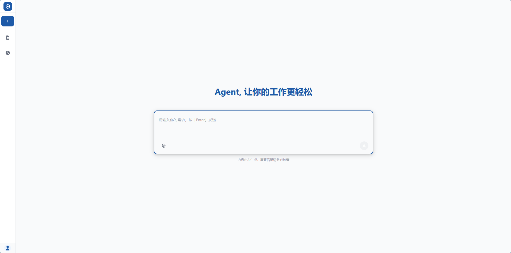
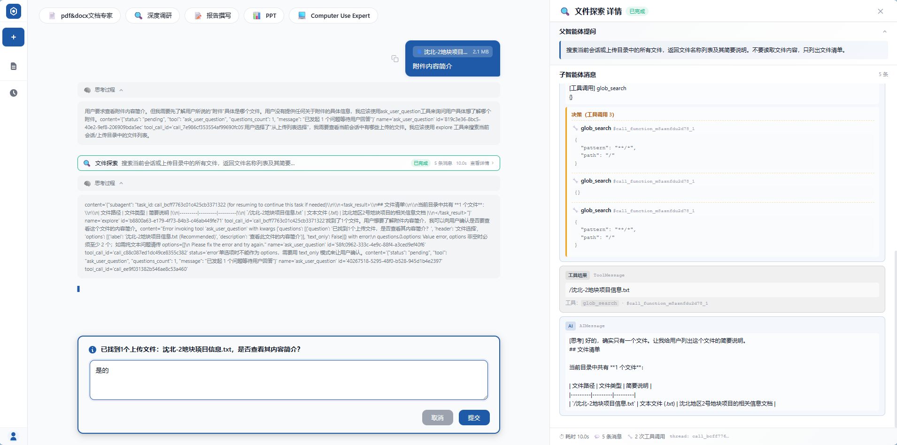
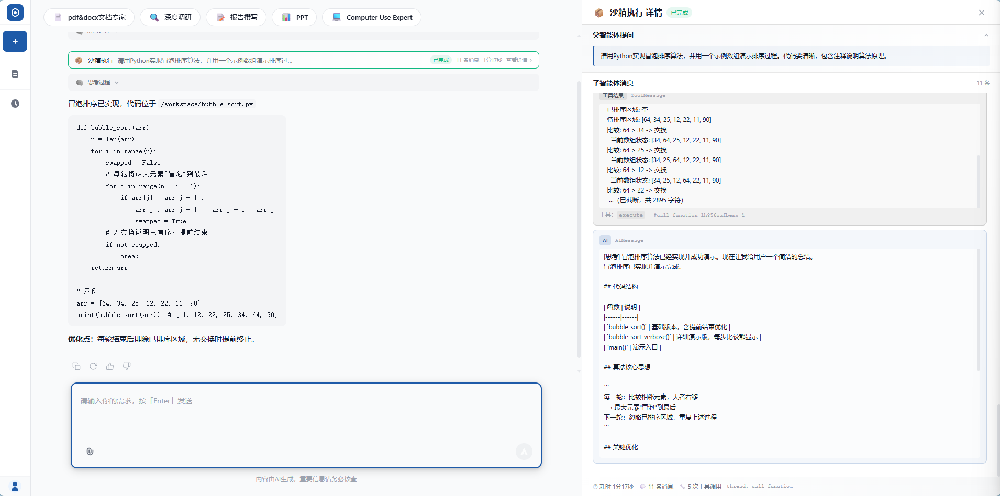

<div align="center">

 

#Agent Core

**面向 LLM · RAG · Agent 场景的企业级智能体运行框架**

<table align="center">
  <thead>
    <tr>
      <th align="center">🧠 核心框架</th>
      <th align="center">🤖 LLM Provider</th>
      <th align="center">🛠️ 基础设施</th>
    </tr>
  </thead>
  <tbody>
    <tr>
      <td align="center">
        <br>
        <br>
        <br>
        <br>
        
      </td>
      <td align="center">
        <br>
        <br>
        <br>
        
      </td>
      <td align="center">
        <br>
        <br>
        <br>
        
      </td>
    </tr>
  </tbody>
</table>


<p align="center">
  🚀 基于 <b>LangGraph v1.0</b> + <b>LangChain</b> · 多 Provider LLM 工厂 · 三层提示词协议 · SSE 流式策略 · MCP 工具生态
</p>

</div>

---

<details>
<summary>📚 一句话能力摘要</summary>

通用智能体运行框架 · 多 LLM Provider 适配 · 三层提示词协议 · 消息裁剪与多模态提取 · SSE 流式策略 · 异步并发队列 · 文件分片上传 · 异步连接池 · FastAPI 应用工厂 · MCP / 子智能体 / HITL 工具生态 · 双 Token 认证 · 图形验证码 · 用户 / 角色管理 · 强制下线 · 审计日志

**🔌 接入方式**
- AI 编程工具：MCP 协议 — 任意 LangChain / LlamaIndex / 自研 Agent 框架
- 业务子图：`Agent` 基类 + `AgentConfig` + `AgentContext` 三件套继承即用
- 开发集成：Python SDK · FastAPI · Docker Compose

</details>

---

## 📋 更新记录

- **2026.06 — 核心运行框架重构**

  本次版本聚焦于 **`app/core/` 通用方法层** 的体系化抽象。主要更新内容包括：

  - **Agent 基类统一化**
    - 基于 `LangGraph v1.0` 的 `MessagesState` 重构通用 Agent 类，统一 `hitl_check → summarize → llm_call → tools` 工作流。
    - `invoke` / `stream` 双调用入口，原生支持 `Command(resume=...)` 中断恢复。
  - **多 Provider LLM 工厂**
    - 新增 `Anthropic` 适配，与 `OpenAI` / `DeepSeek` / `Ollama` 并列纳入注册表。
    - 支持运行时动态注册新模型，无需修改工厂代码。
  - **三层提示词协议**
    - 全局基类提示词 + Agent 专有提示词 + 运行时上下文动态提示词，自动拼接。
  - **SSE 流式策略模式**
    - 抽象 `StreamFormatStrategy` 接口，新增 `Ollama` Provider 策略实现。

---

<!-- 项目介绍 + 作品截图占位 ② -->
<p align="center">
  
</p>


# 项目介绍

**Feature Agent Core** 是一套面向 LLM · RAG · Agent 场景的**通用方法层基础设施**。

它不绑定具体业务场景，而是为上层智能体应用提供可复用、可扩展、可替换的运行底座 —— 涵盖 Agent 运行框架、多模型适配、提示词协议、消息治理、流式输出、并发调度、文件 I/O、数据持久化等横切关注点。业务开发者只需继承 `Agent` 基类、配置 `AgentConfig`、实现专属工具与提示词，即可快速搭建一个生产级智能体服务。

> 项目诞生于自然资源业务智能化的预研过程，目标是沉淀一套与业务解耦的智能体工程化方法论。

---

# 🧠 核心能力

本节按通用方法视角介绍 `app/core/` 中沉淀的六大基础设施能力。

## 🏭 多 Provider LLM 工厂

> 子模块：`app/core/llmcalls/`

采用 **工厂模式 + 注册表模式** 统一管理多厂商大语言模型。

| 特性 | 说明 |
|------|------|
| 内置 Provider | `openai` · `deepseek` · `ollama` · `anthropic` |
| 注册表机制 | `ModelFactory._model_creators` 字典维护类型→构造器映射 |
| 动态扩展 | `ModelFactory.register_model_creator()` 运行时注册新 Provider |
| 不区分大小写 | `model_type.lower()` 归一化 |
| Provider 特定参数 | `Ollama` 额外支持 `reasoning` / `timeout` |

```python
from app.core.llmcalls.model_factory import ModelFactory

# 创建内置模型
model = ModelFactory.create_model(
    model_type="openai",
    model_name="gpt-4",
    api_key="sk-xxx",
    temperature=0.2,
    base_url="https://api.openai.com/v1",
)

# 动态注册自定义 Provider
ModelFactory.register_model_creator("custom", create_custom_model)
```

## 🧬 通用智能体运行框架

> 子模块：`app/core/agent/`

基于 **LangGraph v1.0** 的 `MessagesState` 实现的 `Agent` 基类，是整个体系的运行核心。

**工作流**：
```
START → hitl_check → summarize → llm_call → END
            ↑__________________________|    (有工具时循环 tools)
```

| 节点 | 职责 |
|------|------|
| `hitl_check` | 检查 `pending_question`，调用 `interrupt()` 暂停图执行等待用户回答 |
| `summarize` | `SummarizationNode` 自动摘要旧消息，配合 `trim_messages` 控制 token |
| `llm_call` | 拼接三层提示词（基类 + 专有 + 上下文），调用预绑定的 `llm` 实例 |
| `tools` | `ToolNode` 执行工具调用，结束后回到 `hitl_check` 继续处理 |

**双调用入口**：

```python
# 非流式：等待图执行完成，返回最终状态
result = await agent.invoke(input_state, context, config)

# 流式：实时 yield 每个节点输出，支持 updates / values / messages / custom / 组合
async for chunk in agent.stream(input_state, context, config, stream_mode="updates"):
    print(chunk)

# 中断恢复
async for chunk in agent.stream(Command(resume={"decision": "approve"}), context, config):
    print(chunk)
```

**配置三件套**：

- `AgentConfig` — 数据类封装模型、token、检查点器、存储库、系统提示词等
- `AgentContext` — 运行时上下文（`store_id` / `system_prompt` / `image_ids`）
- `AgentState` — 状态类，继承 `MessagesState` + `pending_question` / `question_answers` / `tool_progress` 等扩展字段

## 📜 提示词与消息协议

> 子模块：`app/core/prompts.py`、`app/core/messages/`

**三层提示词架构**：

```
system_prompt = BASE_SYSTEM_PROMPT   # ① 全局基类（核心原则、知识优先级、子智能体策略）
                + "\n\n" + self.system_prompt   # ② Agent 专有提示词
                + "\n\n" + context.system_prompt  # ③ 运行时上下文动态提示词
```

| 层 | 来源 | 职责 |
|----|------|------|
| ① 全局基类 | `prompts.BASE_SYSTEM_PROMPT` | 核心原则 · 知识优先级 · 工具使用 · 输出规则 · 子智能体策略 |
| ② Agent 专有 | `AgentConfig.system_prompt` | 业务角色 · 行为准则 · 工具选择引导 |
| ③ 上下文动态 | `runtime.context["system_prompt"]` | 任务级临时约束 · 风格定制 |

**消息治理**：

| 能力 | 入口 |
|------|------|
| 按 token 裁剪 | `messages.trim.trim_messages_with_tool_limit()` |
| 按工具调用数裁剪 | `messages.trim.trim_old_tool_messages()` |
| 多模态内容提取 | `messages.converter.extract_message_content()` / `extract_text()` / `extract_full()` |

## 📡 流式输出与并发调度

> 子模块：`app/core/format/stream/`、`app/core/concurrency/`

**SSE 流式策略模式**：

```python
# 抽象基类
class StreamFormatStrategy(ABC):
    @abstractmethod
    def format_content(self, message_chunk, metadata) -> Optional[Any]: ...
    
    @property
    @abstractmethod
    def provider_name(self) -> str: ...
```

| 策略实现 | Provider |
|----------|----------|
| `DefaultStreamFormat` | OpenAI 兼容 / DeepSeek |
| `OllamaStreamFormat` | Ollama（含 reasoning 字段特殊处理） |

新 Provider 只需实现 `format_content` 与 `provider_name`，无需修改 `tool_node`。

**异步并发队列**：

| 能力 | 说明 |
|------|------|
| 单例模式 | 全局共享同一 `AgentConcurrencyQueue` 实例 |
| `asyncio.Semaphore` | 限制同时处理的 Agent 请求数 |
| FIFO 等待 | 超限请求进入有序队列 |
| 位置查询 | `position()` 返回当前调用方在队列中的位置（1-based） |
| 队列快照 | `snapshot()` 返回 `{active_count, waiting_count, max_concurrency}` |

## 🔌 工具与 MCP 生态

> 子模块：`app/core/tools/`

| 组件 | 能力 |
|------|------|
| `BaseTools` | 通用基础工具 — 当前时间、文件加载、分块缓存（`RecursiveCharacterTextSplitter`）、`open_file_by_id` 按 ID 读取 |
| `HumanInTheLoopTools` | `ask_user_question` — 触发 LangGraph `interrupt()` 暂停图执行 |
| `SandboxTools` | 沙箱化执行环境，隔离工具副作用 |
| `FilesystemReadTools` | 文件系统只读工具集 |
| `mcp_wrapper` | MCP 工具包装器 — 自动应用「双重输出策略」（大数据返回摘要，详细数据走 `get_stream_writer`） |
| `mcp_registry` | MCP Servers 注册中心，启动时统一初始化 |
| `subagent_registry` | 子智能体注册表（基于 `BaseStore` 的命名空间隔离） |
| `mcp_tool_adapter` | MCP 工具 → LangChain `BaseTool` 适配器 |
| `subagent_message_extractor` | 子智能体消息流提取器 |
| `_stop_signal` | 工具执行中断信号 |

**MCP 双重输出策略**：

```python
# 小数据 → 完整返回
# 大数据 → 摘要 + stream writer 详细数据
class MCPToolWrapper(BaseTool):
    def _run(self, *args, **kwargs):
        result = self.original_tool._run(*args, **kwargs)
        if len(result) > self.max_content_length:
            summary = result[:self.max_content_length] + "..."
            writer = get_stream_writer()
            writer({"full_result": result})
            return summary
        return result
```

---

## 🚀 子智能体工具（可触发 Sub-Agent）

> 子模块：`app/core/tools/FilesystemReadTools.py`、`app/core/tools/SandboxTools.py`

`explore` 与 `sandbox` 是 `app/core/tools/` 中**两个可触发子智能体**的特殊工具。父 LLM 调用后，**当前工作流会等待子智能体自主完成任务**，子智能体可使用专属中间件、复用 LangGraph Checkpoint，最后将结构化结果以 `Command` + `ToolMessage` 回流至父图。

### 🗂️ explore — 文件探索子智能体

| 项 | 说明 |
|---|---|
| 触发场景 | 复杂文件搜索 + 内容分析（多目录 / 多关键词 / 需读全文 / 跨文件交叉引用） |
| 子智能体能力 | `glob_search` · `grep_search` · `read_file` · `ls` · `write_todos`（任务规划） |
| 挂载中间件 | `TodoListMiddleware` · `EncodingSafeFileSearchMiddleware`（编码安全）· `FilesystemMiddleware` |
| 工作空间 | `data/upload/{session_id}/`，**只读**，子智能体不可修改宿主文件 |
| 并发模型 | 支持**单消息内并发启动多个** `explore` 实例，由父 LLM 触发后并行搜索不同子主题 |
| 会话恢复 | 每次调用返回 `task_id`，传入可恢复历史上下文（LangGraph Checkpoint 持久化） |
| 父 LLM 触发条件 | 任务匹配 `explore` 描述（文件搜索 / 内容提取 / 多文档分析）时**优先**调用，避免父 LLM 直接堆 `read_file` |

<p align="center">
  
</p>
<sub align="center">explore工作流时序图（待补充）</sub>

**典型调用契约**：

```python
@tool(description="Launch a new agent to handle complex, multistep file search ...")
async def explore(
    prompt: str,                     # 高度详细的任务描述（含搜索目标 / 预期返回 / 约束）
    task_id: Optional[str] = None,    # 传入历史 task_id 恢复会话
) -> Command: ...
```

> **Prompt 编写铁律**：`prompt` 不能直接传用户原话，必须由父 LLM **改写为结构化任务描述**，包含搜索目标、文件路径范围、预期输出格式、子智能体应返回的具体信息。

### 🐳 sandbox — 沙箱执行子智能体

| 项 | 说明 |
|---|---|
| 触发场景 | 安全执行代码 / 数据处理 / 动态生成文件 / 跑临时脚本 |
| 隔离级别 | 独立 **Docker 容器**，默认 `network_enabled=False` · `max_memory_mb=512` · `max_cpu_percent=100` · `default_timeout=60s` |
| 子智能体能力 | `ls` · `read_file` · `write_file` · `edit_file` · `glob` · `grep` · `execute`（Shell / Python） |
| 挂载中间件 | `DockerSandboxMiddleware`（继承自 `FilesystemMiddleware`） |
| 工作空间 | `data/upload/{session_id}/sandbox/`，挂载到容器内的工作目录 |
| 用户停止感知 | 每 5 个 chunk 检测 `request.is_disconnected()`，按下停止按钮后**立即**中断子智能体 + 清理容器 |
| 流式事件 | 推 `tool_start` / `tool_progress` / `tool_stop` / `tool_error`，前端可实时展示 5 步进度条 |
| 安全规则 | 容器默认无网络 · 禁止 `rm -rf /` / `mkfs` / `dd` 等破坏性命令 · 资源受限 · 60s 超时 |

<p align="center">
  
</p>
<sub align="center">sandbox工作流时序图（待补充）</sub>

**5 步进度模板**（`SANDBOX_STEPS`）：

```
① code_generation (📝 生成代码)
   ↓
② file_write        (💾 写入文件)
   ↓
③ command_execute   (▶️  执行代码)
   ↓
④ command_output    (📤 获取输出)
   ↓
⑤ result_analysis   (✅ 分析结果)
```

**典型调用契约**：

```python
@tool(description="Launch a sandbox subagent to safely execute code ... in an isolated Docker container.")
async def sandbox(
    prompt: str,    # 高度详细的任务描述（要执行的代码 / 文件操作 / 预期返回）
) -> Command: ...
```

### 🛠️ 工具调用机制

工具与 LLM 的协作遵循统一的**调用契约**，可被所有 `app/core/tools/` 下的工具复用：

```
┌──────────────────────────────────────────────────────────────────────┐
│                       单次工具调用生命周期                              │
├──────────────────────────────────────────────────────────────────────┤
│                                                                      │
│  1. 父 LLM 决策 → 解析 tool_call（name + args）                       │
│            │                                                         │
│            ▼                                                         │
│  2. ToolNode 执行工具 → 注入 ToolRuntime（含 context / store / request）│
│            │                                                         │
│            ▼                                                         │
│  3. 工具执行中 → get_stream_writer() 推 tool_progress（SSE 实时）       │
│            │                                                         │
│            ▼                                                         │
│  4. 工具完成 → 返回 Command(update={messages: [ToolMessage]})         │
│            │                                                         │
│            ▼                                                         │
│  5. 父图回到 hitl_check → summarize → llm_call 继续推理               │
│                                                                      │
└──────────────────────────────────────────────────────────────────────┘
```

| 关键能力 | 入口 |
|---|---|
| 工具运行时上下文 | `ToolRuntime[AgentContext]` — 自动注入 `context` / `store` / `tool_call_id` |
| 流式事件推送 | `get_stream_writer()` + `create_tool_event()` 推 `tool_start` / `tool_progress` / `tool_stop` / `tool_error` |
| 中断恢复 | 父 LLM 收到 `ToolMessage` 后继续；子智能体本身可被 `Command(resume=...)` 恢复 |
| 用户停止信号 | 通过 ContextVar 注入 FastAPI `Request`，工具内部 `is_disconnected()` 检测 |
| 大数据返回 | `MCPToolWrapper` 自动应用双重输出策略（完整结果 → SSE 流 / 摘要 → 父 LLM） |
| 结构化输出 | 父 LLM 收到 `<task_result>{json}</task_result>` 格式，统一解析 |

**子智能体与父图的关系**：

```
父 Agent (MessagesState)
   │
   │  ToolNode
   ▼
explore / sandbox 工具
   │
   │  create_agent / create_deep_agent
   ▼
子智能体 (独立 Checkpoint · 独立中间件)
   │
   │  ToolMessage({"subagent": "..."}, tool_call_id=parent_tcid)
   ▼
回流到父 messages → 父 LLM 继续推理
```

---

## 💾 数据与基础设施

> 子模块：`app/core/database.py`、`app/core/router/`、`app/core/server.py`、`app/core/dependencies.py`

**异步数据库连接池**：

| 能力 | 说明 |
|------|------|
| `asyncpg.Pool` 单例 | 进程级复用 |
| `@register_schema` 装饰器 | 业务模块声明式注册表结构，启动时统一初始化 |
| 环境变量控制 | `AUTH_STORAGE_MODE` 切换启用 / 关闭 |

**文件 I/O 路由**（`/api/core/*`）：

| 接口 | 方法 | 能力 |
|------|------|------|
| `/uploadfile` | POST | 单 / 多文件上传，自动解析文档 |
| `/upload-chunk` | POST | 大文件分片上传 |
| `/merge-chunks` | POST | 合并已上传分片 |
| `/download` | GET | 单文件下载 |
| `/batch-download` | POST | 批量下载 / 断点续传 |

**FastAPI 应用工厂**（`server.py`）：

| 能力 | 说明 |
|------|------|
| 生命周期管理 | `lifespan` 初始化 DB → Session → Checkpointer → MCP Registry |
| 中间件链 | CORS + `auth_middleware` + `session_auth_middleware` |
| 静态文件 | `StaticFiles` 挂载前端 SPA |
| 依赖注入 | `dependencies.py` 暴露 FastAPI Depends |

---

<!-- 核心能力总览截图占位 ③ -->
<p align="center">
  
</p>
<sub align="center">作品截图占位 ③ — 核心模块依赖图 / 类图 / 时序图（待补充）</sub>

# 🚀 快速开始

### 环境要求

- Python 3.10+
- pip 或 uv 包管理器
- 可选：PostgreSQL（启用 DB 持久化时需要）

### 安装

```bash
git clone <repository-url>
cd feature-agent-core

python -m venv venv
source venv/bin/activate  # Linux/Mac
venv\Scripts\activate     # Windows

pip install -r requirements.txt
```

### 配置

```bash
cp .env.example .env
```

`.env` 关键配置：

```env
# 大模型配置（示例：OpenAI 兼容）
MODEL_TYPE=openai
MODEL_NAME=gpt-4
MODEL_API_KEY=your-api-key
MODEL_API_BASE=https://api.openai.com/v1
MODEL_TEMPERATURE=0.2
```

### 启动

```bash
python -m app.main
# 或
uvicorn app.main:app --host 0.0.0.0 --port 8000
```

服务启动后访问：
- API 文档：<http://localhost:8000/docs>
- 健康检查：<http://localhost:8000/health>

### Docker 部署

```bash
docker-compose up -d
docker-compose logs -f agents
```

---

<!-- 架构总览 — 文本图 -->
# 🏗️ 架构总览

```
┌─────────────────────────────────────────────────────────────────────────────────┐
│                       feature-agent-core · 整体架构                              │
└─────────────────────────────────────────────────────────────────────────────────┘

    ┌──────────────────┐        ┌──────────────────┐        ┌──────────────────┐
    │   Web Frontend   │  HTTP  │   FastAPI App    │  WS    │  SSE Stream      │
    │   (Vue / HTML)   │◀──────▶│  (server.py)     │◀──────▶│  (format/stream) │
    └──────────────────┘        └────────┬─────────┘        └──────────────────┘
                                          │
                          ┌───────────────┼───────────────┐
                          ▼               ▼               ▼
                  ┌──────────────┐ ┌──────────────┐ ┌──────────────┐
                  │  Auth /      │ │   Core       │ │   File       │
                  │  Session     │ │   Agent      │ │   Router     │
                  │  Middleware  │ │   (core/agent)│ │   (core/rtr) │
                  └──────┬───────┘ └──────┬───────┘ └──────┬───────┘
                         │                │                │
                         ▼                ▼                ▼
                  ┌──────────────┐ ┌──────────────┐ ┌──────────────┐
                  │  PostgreSQL  │ │  LLM Factory │ │  Local FS /  │
                  │  (asyncpg)   │ │ (core/llm    │ │  Doc Parser  │
                  │              │ │   calls)     │ │              │
                  └──────────────┘ └──────┬───────┘ └──────────────┘
                                          │
                         ┌────────────────┼────────────────┐
                         ▼                ▼                ▼
                  ┌──────────────┐ ┌──────────────┐ ┌──────────────┐
                  │   OpenAI     │ │   DeepSeek   │ │   Ollama     │
                  │  / 兼容 API  │ │     API      │ │   / Local    │
                  └──────────────┘ └──────────────┘ └──────────────┘
                                          ▲
                                          │
                                  ┌───────┴───────┐
                                  │   Anthropic   │
                                  │      API      │
                                  └───────────────┘

┌─────────────────────────────────────────────────────────────────────────────────┐
│                       core/ 通用方法层 · 内部依赖关系                              │
└─────────────────────────────────────────────────────────────────────────────────┘

                       ┌─────────────────────┐
                       │   config/           │
                       │  (settings / cfg)   │
                       └──────────┬──────────┘
                                  │ 配置注入
            ┌─────────────────────┼─────────────────────┐
            ▼                     ▼                     ▼
   ┌─────────────────┐   ┌─────────────────┐   ┌─────────────────┐
   │   llmcalls/     │   │   prompts.py    │   │  database.py    │
   │  ModelFactory   │   │ BASE_SYSTEM_*   │   │  DatabasePool   │
   └────────┬────────┘   └────────┬────────┘   └────────┬────────┘
            │                     │                     │
            └──────────┬──────────┴──────────┬──────────┘
                       ▼                     ▼
              ┌─────────────────┐   ┌─────────────────┐
              │   agent/        │   │   messages/     │
              │ Agent 基类       │   │ trim / extract  │
              │ Config / Ctx    │   │                 │
              └────────┬────────┘   └─────────────────┘
                       │ 使用
            ┌──────────┼──────────────┬─────────────┐
            ▼          ▼              ▼             ▼
   ┌─────────────┐ ┌────────┐  ┌─────────────┐ ┌──────────────┐
   │  tools/     │ │ format/│  │ concurrency/│ │  router/     │
   │ BaseTools   │ │ stream/│  │ AsyncQueue  │ │ file upload/ │
   │ HITL / MCP  │ │ SSE    │  │             │ │ download     │
   │ subagent    │ │        │  │             │ │              │
   └──────┬──────┘ └────────┘  └─────────────┘ └──────────────┘
          │ 触发
          ▼
   ┌─────────────────┐         ┌──────────────────┐
   │  子智能体        │         │  Docker 沙箱     │
   │ explore (只读)  │         │  sandbox (隔离)  │
   │ + checkpoint    │         │  + 中间件         │
   └─────────────────┘         └──────────────────┘

┌─────────────────────────────────────────────────────────────────────────────────┐
│  业务层 (features/) — 在 core/ Agent 基类上构建的领域智能体                       │
└─────────────────────────────────────────────────────────────────────────────────┘

         ┌─────────────────────────────────────────────┐
         │  MainAgent (LangGraph 状态图)                 │
         │  hitl_check → summarize → llm_call → tools  │
         └────────────────────┬────────────────────────┘
                              │ 路由
         ┌─────────────┬──────┴──────┬─────────────┐
         ▼             ▼             ▼             ▼
      子智能体 A    子智能体 B    子智能体 C    子智能体 D
      (继承 Agent) (继承 Agent) (继承 Agent) (继承 Agent)
```

**核心设计原则**：

- **业务与基座解耦** — 业务智能体只继承 `Agent` 基类，不直接耦合 core 内部实现
- **协议可替换** — LLM、流式策略、文件存储、提示词均通过注册表 / 策略模式解耦
- **状态可观测** — `AgentState` 内置 `tool_progress` / `intermediate_results`，支持审计与调试
- **中断可恢复** — 统一的 `interrupt()` / `Command(resume=...)` 协议，HITL 与子智能体共用

---

# 🧩 扩展指南

新增 Provider / 工具 / 业务智能体的扩展点：

| 扩展目标 | 扩展点 | 操作 |
|----------|--------|------|
| 新 LLM Provider | `app/core/llmcalls/` | 实现 `create_model` → `ModelFactory.register_model_creator()` |
| 新流式策略 | `app/core/format/stream/` | 继承 `StreamFormatStrategy` 实现 `format_content` 与 `provider_name` |
| 新工具 | `app/core/tools/` | 继承 `BaseTools` 或使用 `@tool` 装饰器 |
| 新 MCP Server | `mcp_registry` | 在 `settings.mcp` 中追加配置 |
| 新业务智能体 | `app/features/<your_agent>/` | 继承 `Agent` 基类 + 自定义 `AgentConfig` + `AgentContext` |
| 新 Schema | `database.py` | `@register_schema` 装饰器声明初始化函数 |

---

# ❓ FAQ

**Q1：如何注册自定义 LLM Provider？**

调用 `ModelFactory.register_model_creator("custom_name", create_custom_model)` 即可，工厂支持热注册，无需修改源码。

**Q2：HITL 中断如何恢复？**

`hitl_check` 节点检测到 `pending_question` 时调用 `interrupt()` 暂停图执行，前端收到中断事件后将用户答案通过 `Command(resume={"answers": [...]})` 传入 `stream()` 恢复执行。

**Q3：如何控制对话上下文长度？**

通过 `AgentConfig` 中的 `max_tokens` / `max_tokens_before_summary` / `max_summary_tokens` 三参数控制 `SummarizationNode` 行为；亦可启用 `trim_tool_messages` 按工具调用次数裁剪旧消息。

**Q4：MCP 工具返回大数据如何处理？**

`MCPToolWrapper` 自动应用双重输出策略：超过 `max_content_length` 时返回摘要，详细数据通过 `get_stream_writer` 流式下发至 SSE。

---

# 👤 关于作者

> 本节用于简历投递时的个人信息展示。

| 项目 | 内容 |
|------|------|
| 姓名 | 张镒谱 |
| GitHub | `<your-github-handle>` |
| Email | `<your-email@example.com>` |
| 个人网站 | `<your-personal-site>` |
| 方向 | 大语言模型工程化 · Agent 框架 · 智能体基础设施 |
| 技术栈 | Python · FastAPI · LangGraph · LangChain · PostgreSQL · asyncpg · Docker |

```python
about_me = {
    "name": "张镒谱",
    "role": "AI Agent / LLM Infra Engineer",
    "stack": ["Python", "FastAPI", "LangGraph", "LangChain", "PostgreSQL", "Docker"],
    "interests": ["Agent Frameworks", "RAG", "Tool Protocols (MCP)", "Async Infra"],
    "open_to": "AI 平台 / Agent 框架 / LLM 基础设施 相关岗位",
}
```

---

# 📄 License

MIT License — 详见 [LICENSE](LICENSE) 文件。

---

# 🙏 致谢

本项目构建于以下优秀开源项目之上：

- [LangGraph](https://github.com/langchain-ai/langgraph) — Agent 状态图运行时
- [LangChain](https://github.com/langchain-ai/langchain) — LLM 应用开发框架
- [FastAPI](https://github.com/tiangolo/fastapi) — 高性能 Web 框架
- [asyncpg](https://github.com/MagicStack/asyncpg) — 异步 PostgreSQL 驱动
- [langmem](https://github.com/langchain-ai/langmem) — 短期 / 长期记忆管理
- [Model Context Protocol](https://modelcontextprotocol.io) — MCP 工具协议

