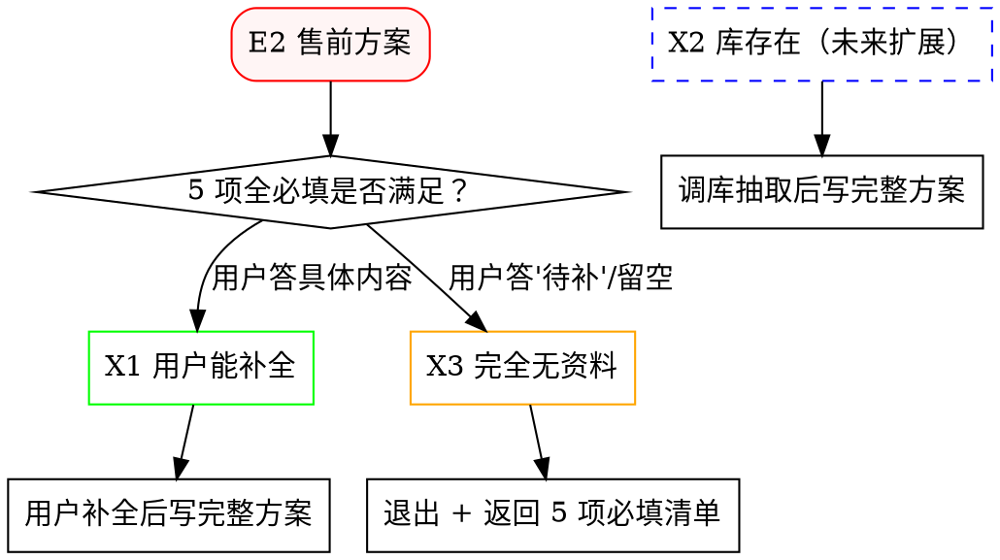

# E.intent_detail · 创作模式（4 选项 · 必走 · 关键）

> 配套 `../SKILL.md` 使用
> 场景分类：E. 创作模式（intent_detail）
> 触发条件：A.intent 中 action_intent = "生成" 或 "更新" 时**必走**（查询场景不适用）

## 概述

任何 project-doc skill 启动时，若 A.intent 走完第 5 子项（action_intent）确认是"生成"或"更新"动作，**必须**继续走 E.intent_detail 维度，确认"创作模式"是 4 种中的哪一种。

**4 个选项之间互斥**，选 1 个即决定后续所有流程的分支走向。

---

## 4 个选项

| 选项 | 含义 | 触发特征（用户话术中常含的关键词） | 后续路径 |
|---|---|---|---|
| **E1. 基于已有资料生成** | 项目根目录里有可证资料（策划表/需求/方案/合同/周报/邮件） | "基于项目资料""按需求写""用项目已有文档" | query → outline 版本 A → write 常规 |
| **E2. 全新独立生成** | 项目资料里**没有**该类型文档；按用户后续输入 + 行业最佳实践生成 | "**全新**""从0""**没有母版**""重新写" | **跳 query** → C.environment（含 5 业务材料）→ outline 版本 B → write Step 3.B 全新分支 |
| **E3. 增量更新已有文档** | 已有同类 docx，补充/修改某些章节 | "在 XX 文档基础上""补充第 X 章""修订一下" | query → outline（增量模式）→ write 增量模式 |
| **E4. 仿写其他项目** | 参照另一项目同类文档的格式/章节 | "按 XX 项目的格式""参照 XX 文档" | 让用户指定参照项目 → 加载该 docx → workflow 常规 |

---

## 询问话术（必走 · 第 1 轮澄清）

在 A.intent 走完前，**先问这一题**。**单选，4 选 1**：

```markdown
在确认目标文档类型和动作前，先确认"创作模式"：

| 选项 | 含义 | 您选哪个？ |
|---|---|---|
| **E1** | 基于项目已有资料生成（策划表/需求/方案/合同/周报 等） | |
| **E2** | 全新独立生成（项目里**没有**该类型文档） | |
| **E3** | 增量更新已有同类 docx（补充/修改某些章节） | |
| **E4** | 仿写其他项目同类文档（指定参照项目） | |

> 提示：如果您原话里已明确（如"全新的""基于已有"），告诉我对应编号即可。
```

---

## E2 全新独立生成的强制项（关键）

E2 是最容易出错的场景。**写前必问**（C.environment 维度 · 5 项业务材料子项，见 `../project-doc-outline/references/tech_value_proposition.md`）：

| # | 项目 | 询问话术（必问） | **必填** |
|---|---|---|---|
| 11 | **目标客户层级** | 这份文档面向：决策层 / 管理层 / 技术层？（影响"为什么 vs 怎么做"角度） | **必填**（5 项全必填） |
| 12 | **核心技术创新亮点** | 您希望突出哪些技术亮点？（**条数自定**，每条 1 段含客户价值） | **必填**（5 项全必填） |
| 13 | **客户价值主张** | 业务价值 / 社会价值 / 投资回报（各 1 段） | **必填**（5 项全必填） |
| 14 | **团队与资质** | 类似项目案例 + 资质证书清单？ | **必填**（5 项全必填） |
| 15 | **行业差异化** | 相对竞品的优势？（至少 3 点） | **必填**（5 项全必填） |

> **5 项全必填**（D3 决定）：售前方案下 #11-15 全部必填，任一项未填就**直接退出 X3**，**不**继续走 X1 写正文。

---

## E2 售前方案 3 选 1 决策（2026-06-XX 新增 · 关键）

售前方案在 E2 场景下走"3 选 1 决策"，**不**直接进入写正文流程。



### X1 · 用户能补全材料（当前主推路径）

**触发**：用户在 5 业务材料澄清阶段回答**具体内容**（不是"待补"或留空）。

**流程**：
1. 5 业务材料全填（#11-15）→ 加载 `outline_售前方案.md` 版本 B
2. 输出章节大纲（**完全无"待补"**字样，因为用户已提供全部材料）
3. 用户确认大纲 → write Step 3.B 写完整方案

### X2 · 公司销售档案库（**未来扩展 · 本轮不实现**）

**触发**：库存在且能自动抽取所需材料。

**未来接口预留**（`## 未来扩展：X2 公司销售档案库` 段）：

```markdown
## 未来扩展：X2 公司销售档案库（待实现）

**目标**：当公司销售档案库可用时，E2 售前方案下可走 X2 路径。

**接口预留**：
- 库路径：`<待定 · 待公司指定>`（建议放在 `<公司档案库根>/销售档案/<行业>/<客户>/<项目>/`）
- 调库脚本：`<待定>`（建议参考 `project-doc-write/scripts/read_doc.py` 的统一加载方式）
- 抽取字段映射：#11-15 业务材料 ↔ 销售档案中的对应字段
- 状态：本轮**不**实现；如未来有库，由 `project-doc-hub` 在 Step 2-c 自动检测库存在性并分流

**当前默认行为**：库不存在 → 自动降级到 X1 或 X3
```

### X3 · 完全无资料 / 用户不补全（**直接退出**）

**触发**：5 业务材料中**任一项**未填（答"待补"/留空）。

**严禁**：
- ❌ 写一个满是"待补"的售前方案大纲
- ❌ 用"示例性内容 / 行业通用模板 / 公司典型规模"占位
- ❌ 任何形式的占位

**X3 退出标准回复模板**（必走 · 复制即用）：

```markdown
售前方案是项目立项前的对外材料，**按当前约束无法生成合规方案**。

**当前约束**：
- 无项目资料（项目根目录下无售前方案母版）
- 无公司销售档案库可调用（本套件当前版本不支持自动抽取）

**需要您提供的材料清单**（**5 项业务材料，全必填**）：

| # | 项目 | 您需要提供的内容 | 必填 |
|---|---|---|---|
| 11 | 目标客户层级 | 决策层 / 管理层 / 技术层（4 选 1） | 必填 |
| 12 | 核心技术创新亮点 | 1-5 条，每条 1 段含客户价值 | 必填 |
| 13 | 客户价值主张 | 业务价值 / 社会价值 / 投资回报 各 1 段 | 必填 |
| 14 | 团队与资质 | 公司核心成员 + 类似项目案例 + 资质证书清单 | 必填 |
| 15 | 行业差异化 | 相对竞品的优势，至少 3 点 | 必填 |

**操作选项**：
- (a) 您现在补充上述材料（按"12=xxx；13=xxx"格式回复）→ 我立即写完整方案
- (b) 您先准备材料，下次再写

**禁止选项**：
- ❌ 不允许用"示例性内容"占位（售前方案是成品文档，不能含"待补/示例/行业通用"等占位符）
- ❌ 不允许用"5 项全'待补'写一个示意版"——这是 X3 退出条件，不是占位条件

请选择 (a) 或 (b)；选 (a) 时请直接补充 5 项业务材料的具体内容。
```

**5 项全必填校验逻辑**（X3 退出前必走）：

```python
# 伪代码（模型自检）
if doc_type == "售前方案" and E.intent_detail == "E2":
    required_business_materials = ["#11", "#12", "#13", "#14", "#15"]
    for item in required_business_materials:
        if user_answer[item] is None or user_answer[item] == "待补" or user_answer[item] == "":
            trigger_x3_exit(missing_item=item)
            return  # 不进入 outline / write
    # 5 项全填 → 进入 X1 流程
    load_outline_售前方案_版本B()
    generate_outline()
```

---

## E2 写中严禁项（写正文时必带项）

**写中严禁**（售前方案/对外营销材料等 E2 场景，**不**允许出现"待补"）：

- ❌ **禁止出现"**待补**"占位**（售前方案是成品文档）
- ❌ **禁止**用"示例性内容 / 行业通用模板 / 公司典型规模"占位
- ❌ **禁止**具体数据库字段设计
- ❌ **禁止**具体审批流程
- ❌ **禁止**具体 API 接口、表结构、按钮级功能
- ❌ **禁止**行业里"千篇一律"的通用功能描述（如"系统具有先进性、可靠性、易用性"）

**写中必带**（E2 售前方案）：

- ✅ 每章末必须有"**客户价值**"小段（不超 2 段）
- ✅ 每章末必须有"**相对优势**"小段（对比行业通行做法）
- ✅ 数据源标注：`<用户提供的资料文件名 + 行号>` / `"用户提供口述"`
- ❌ **禁止**用"**待补**：<字段名>"作为数据源标注（B 类文档不允许）

---

## E2 在各 skill 流程中的具体落地

| skill | E2 售前方案场景的特殊处理 |
|---|---|
| `project-doc-hub` | 走 Step 2 时，E2 跳过 query 整步；5 业务材料全必填校验；任一未填 → 触发 X3 退出 |
| `project-doc-outline` | 5 项全填 → 加载 outline 版本 B（价值主张导向）；任一未填 → **不**加载模板，触发 X3 退出 |
| `project-doc-write` | 走 Step 3.B 全新分支；加载 `references/value_proposition_template.md`；每章结构 = 要点 + 客户价值 + 相对优势 + 数据源；**不**允许"待补"占位 |
| `project-doc-workflow` | 走 4 步流水线但 query 步骤压缩为"无资料跳过"；5 项未填 → 终止于 X3 退出 |

---

## 记录到日志

```bash
python manage_project_log.py append-clarification \
    --project-id <ID> --work-root <ROOT> \
    --dimension "E.intent_detail" --item "creation_mode" \
    --question "创作模式？" --answer "E2 全新独立生成" \
    --source "用户口述" --asked-by "project-doc-hub"
```

dimension 标识统一为 `E.intent_detail`；item 标识：
- `creation_mode`（E1/E2/E3/E4）

---

## 反模式（严禁）

| 反模式 | 后果 |
|---|---|
| action_intent = "生成" 直接跳过 E.intent_detail | 全新场景被误当"基于资料"，编造技术细节 |
| E2 没问 5 项业务材料就写 | 大纲/正文与售前场景不匹配，被客户反问 |
| E2 写"具体怎么做" | 违反"售前方案面向决策层，应写为什么这样做最好" |
| E2 写"—/TBD/待定"单独占位 | 违反 `<HARD-GATE: NO FABRICATION>` |
| E2 直接套用版本 A 大纲（实施细节导向） | 章节粒度与售前场景不匹配 |

---

## 触发示例

**用户**：用泊头项目写一份**全新的**售前技术方案

**第 1 轮澄清**（E.intent_detail）：
> 在确认目标文档类型和动作前，先确认"创作模式"：
> - E1 基于项目已有资料生成
> - **E2 全新独立生成** ← 用户原话"全新的"暗示此选
> - E3 增量更新已有同类 docx
> - E4 仿写其他项目

**第 2 轮澄清**（A.intent 5 子项）：
> 1. 目标文档类型 = 售前方案
> 2. 项目根目录 = 泊头项目路径
> 3. 动作意图 = 生成
> 4. fact/decision + scope ...

**第 3 轮澄清**（C.environment · E2 必问 5 业务材料）：
> 1. 目标客户层级？
> 2. 技术亮点？
> 3. 价值主张？
> 4. 团队与资质？
> 5. 行业差异化？

**第 4 轮** → 加载 `outline_售前方案.md` **版本 B** → 输出大纲 → 用户确认 → write Step 3.B
