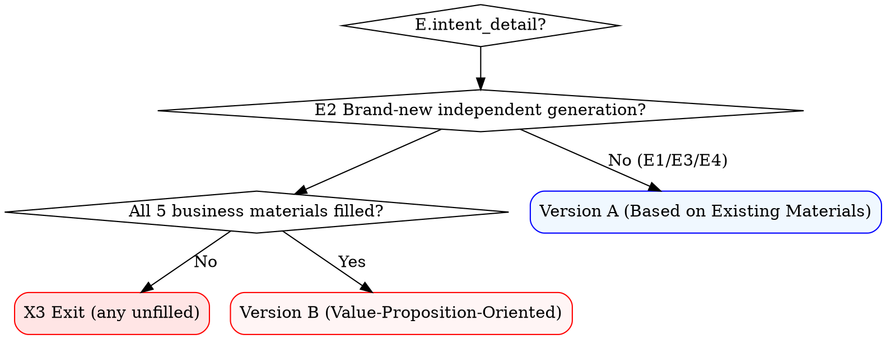

# Pre-Sales Proposal — Outline Template

> Applies to: Presenting the proposal to clients / senior leadership before project initiation
> Review: Usually no formal review required; treated as external marketing material
> Reference source: 项目根目录/03_技术文档及评审/00_售前方案/ — historical pre-sales proposals under that directory
> **This file contains two versions; choose based on E.intent_detail routing**

---

## ⚠️ Pre-Check (required before writing the outline · 2026-06-XX second reinforcement)

> **Five** business materials must be validated as all-required before loading this template.

- ❌ Any of the 5 business materials (#11-15) **unfilled** (answered "Pending-fill" / left blank) → **forbidden from loading this template**; **exit X3 directly**
- ❌ Loading this template after all 5 items are "Pending-fill" → treated as an anti-pattern
- ❌ Outputting an outline that contains "**Pending-fill**" (待补) after loading this template → treated as an anti-pattern
- ✅ All 5 items filled → load this template and output an outline **with absolutely no "Pending-fill" text**

**X3 Exit Standard Reply Template**:

```markdown
The pre-sales proposal is external material before project initiation. **Under the current constraints, a compliant proposal cannot be generated**.

**All 5 business materials are required** (#11-15). If any is unfilled → exit X3:

| # | Item | Content You Need to Provide | Required |
|---|---|---|---|
| 11 | Target Client Tier | Decision-maker / Management / Technical (choose 1 of 4) | Required |
| 12 | Core Technical Innovation Highlights | 1-5 items, each 1 paragraph including client value | Required |
| 13 | Client Value Proposition | Business value / Social value / ROI — 1 paragraph each | Required |
| 14 | Team & Qualifications | Core company members + similar project cases + qualification certificate list | Required |
| 15 | Industry Differentiation | Advantages over competitors, at least 3 points | Required |

**Action Options**:
- (a) You provide the above materials now (reply in the format "12=xxx; 13=xxx") → I will write the complete proposal immediately
- (b) You prepare the materials first and write next time

**Forbidden Options**:
- ❌ Using "illustrative content" as a placeholder (the pre-sales proposal is a finished document)
- ❌ Using "all 5 items 'Pending-fill' to write a sketch version" — this is the X3 exit condition, not a placeholder condition
```

---

## Version Routing Logic (required)



> The hub / outline skill must first ask E.intent_detail, then select the version per the table above. **E2 pre-sales proposal + any of 5 items unfilled → exit X3; substituting with Version A/B is not allowed.**

---

## Version A: Generated from Existing Materials (E1 / E3 / E4)

> Applies when: The project root contains verifiable materials (Planning Sheet / requirements / proposal / contract / weekly reports) from which business descriptions / technical parameters / schedule numbers can be drawn

### Chapter Structure

1. **Project Overview**
   - 1.1 Project Background
   - 1.2 Construction Goals
   - 1.3 Construction Scope
2. **Current Status Analysis**
   - 2.1 Business Status
   - 2.2 IT Status
   - 2.3 Main Pain Points
3. **Requirements Understanding**
   - 3.1 Business Requirements
   - 3.2 User Requirements
   - 3.3 Key Constraints
4. **Construction Plan**
   - 4.1 Overall Architecture
   - 4.2 Functional Architecture
   - 4.3 Technical Architecture
   - 4.4 Deployment Architecture
5. **Implementation Plan**
   - 5.1 Implementation Phase Division
   - 5.2 Key Milestones
   - 5.3 Resource Estimation
6. **Project Value**
   - 6.1 Business Value
   - 6.2 Social Value
   - 6.3 ROI
7. **Team and Assurance**
   - 7.1 Project Team
   - 7.2 Quality Assurance
   - 7.3 Risks and Response
8. **Appendix**
   - 8.1 Qualification Certificates
   - 8.2 Similar Project Cases
   - 8.3 Contact Information

---

## Version B: Brand-New Independent Generation (E2 · 2026-06-XX second reinforcement · Key Changes)

> Applies when: Before project initiation, **the user has provided all 5 business materials** (items #11-15 fully filled); the pre-sales proposal is external marketing material before project initiation
> Angle: Shift from "technical implementation details" to "**why this is the best approach + client value**"
> Chapter granularity: Abstracted to a level readable by decision-makers; **do not write specific technical details**
> **Absolutely no "Pending-fill" placeholders** (the user has already provided all materials)

### Chapter Structure

#### 1. **Project Overview**

- 1.1 Policy Background (national → provincial → municipal three-tier policy drivers)
  - **Data source**: User-provided oral input
- 1.2 Client Positioning and Construction Goals
  - **Data source**: E2 clarification item 11 user answer (target client tier = decision-makers)
- 1.3 Construction Scope
  - **Data source**: User-provided oral input

#### 2. **Current Status and Challenges**

- 2.1 Industry Status
  - **Data source**: User-provided oral input
- 2.2 Core Pain Points
  - **Data source**: User-provided oral input (E2 clarification items 15 + 13)
- 2.3 Client Requirements Understanding
  - **Data source**: User-provided oral input

#### 3. **Overall Solution**

- 3.1 Design Philosophy (**why** this is the best approach, **not** design details)
  - **Data source**: User-provided oral input (based on E2 clarification item 12 technical highlights)
- 3.2 Overall Architecture (one chart perspective; no component inventory)
  - **Data source**: User-provided oral input (based on tech_architecture answer among the 10 technical points)
- 3.3 Technical Innovation Highlights
  - **Data source**: Highlights from E2 clarification item 12 user answer (**number of items self-defined**)
  - **Strictly forbidden to write "Five Major"** (the number 5 is baseless; let the user define the count)

#### 4. **Construction Plan** (each chapter highlights "plan advantages + client value"; **no implementation details**)

| Chapter | Content (E2 Value-Oriented) | Strictly Forbidden (Implementation Details) |
|---|---|---|
| 4.1 Cadastral Database (**or Business Object Layer**) | Data governance strategy + how unified-code linking solves data silos + client value | ❌ Specific fields, ❌ table structure, ❌ SQL, ❌ data dictionary |
| 4.2 New Survey Mechanism (**or Business Mechanism Layer**) | Design philosophy of "routine + periodic" update mechanism + how it embeds into existing business processes + highlights for avoiding duplicate surveys | ❌ Specific approval processes, ❌ job responsibilities |
| 4.3 Management System (**or Application System Layer**) | Scalability advantages of microservices + how subsystems collaborate to form a closed loop + visualization capabilities | ❌ API interfaces, ❌ table structure, ❌ button-level features |
| 4.4 Deployment Architecture | Layered deployment + localization adaptation + security compliance approach | ❌ Specific server models, ❌ network topology details |

> **General rule**: Each 4.x chapter must end with a "**Client Value**" subsection (no more than 2 paragraphs) and a "**Relative Advantage**" subsection (compared with industry common practice).
> **Data source**: User-provided oral input (based on E2 clarification item 15 industry differentiation)

#### 5. **Implementation Plan**

- 5.1 Implementation Phase Division
  - **Data source**: User-provided oral input (user must provide during the X1 stage)
- 5.2 Key Milestones
  - **Data source**: User-provided oral input (user must provide during the X1 stage)
- 5.3 Resource Estimation
  - **Data source**: User-provided oral input (user must provide during the X1 stage; includes team size / hours / cost)

#### 6. **Project Value**

- 6.1 Business Value
  - **Data source**: E2 clarification item 13 user answer
- 6.2 Social Value
  - **Data source**: E2 clarification item 13 user answer
- 6.3 ROI
  - **Data source**: E2 clarification item 13 user answer

#### 7. **Team and Assurance**

- 7.1 Project Team
  - **Data source**: E2 clarification item 14 user answer (team size + role breakdown)
  - **Strictly forbidden to write specific names** (the pre-sales proposal does not expose personal privacy; only team size and roles are given)
- 7.2 Qualification Certificates
  - **Data source**: E2 clarification item 14 user answer
- 7.3 Similar Project Cases
  - **Data source**: E2 clarification item 14 user answer

#### 8. **Risks and Response**

- 8.1 Project Risk Identification
  - **Data source**: User-provided oral input
- 8.2 Risk Response Strategy
  - **Data source**: User-provided oral input
- 8.3 Emergency Assurance
  - **Data source**: User-provided oral input

---

### Version B — Items to Avoid (Strictly Forbidden in E2 Scenarios)

> The body text **strictly forbids** the following content (violates `<HARD-GATE: NO FABRICATION>` + `<HARD-GATE: Differentiate "Pending-fill" handling by document type>`):

- ❌ **"**Pending-fill**" (待补) placeholders** (the pre-sales proposal is a finished document; **absolutely no "Pending-fill" text**)
- ❌ **"Illustrative content / industry generic template / typical company scale" placeholders**
- ❌ **"**Pending-fill**: <field name>"** (the pre-sales proposal does not allow this placeholder)
- ❌ Specific database field design
- ❌ Specific approval processes
- ❌ Specific API interfaces, table structures, button-level features
- ❌ "Pending-fill" annotations on specific ROI numbers (user must fill concrete values in #13)
- ❌ "One-size-fits-all" generic feature descriptions in the industry (e.g., "the system is advanced, reliable, easy to use, secure, and scalable")
- ❌ Specific team member names (only team size and roles; do **not** expose individuals)

### Version B — Required Elements (at the end of each chapter)

- ✅ **Plan Highlights** (no more than 3 paragraphs, explaining "why this is the best approach")
- ✅ **Client Value** (no more than 2 paragraphs, quantitative or qualitative)
- ✅ **Relative Advantage** (no more than 2 paragraphs, compared with industry common practice)
- ✅ **Data source annotation**: `<user-provided material filename + line number>` / `"User-provided oral input"`

### Version B — Chapter Naming Parameterization

> The chapter names 4.1-4.4 (Cadastral Database / New Survey Mechanism / Management System / Deployment Architecture) use the **Botou Cadastral Survey** project as an example. Other industries need **parameterized substitution**:
>
> | Industry | 4.1 | 4.2 | 4.3 | 4.4 |
> |---|---|---|---|---|
> | Cadastral Survey | Cadastral Database | New Survey Mechanism | Management System | Deployment Architecture |
> | Real Estate Registration | Registration Database | Business Handling Mechanism | Registration System | Deployment Architecture |
> | Territorial Spatial Planning | Planning Database | Assessment & Early Warning Mechanism | Planning System | Deployment Architecture |
> | General Government Affairs | Business Data Layer | Business Process Layer | Application System Layer | Deployment Architecture |
>
> In E2 scenarios, hub/outline should dynamically choose the naming based on the user's clarification item 12 "technical highlights".

---

## Key Differences Between Version B and Version A

| Dimension | Version A (Material-Based) | Version B (Brand-New) |
|---|---|---|
| Chapter granularity | Medium (architecture level + implementation level) | Coarse (decision-maker readable) |
| Data source | Project Planning Sheet / requirements / contract | User oral input (X1 must fill 5 business materials) |
| Value proposition position | Concentrated in Chapter 6 | Embedded at the end of each chapter |
| Technical details | Detailed (architecture diagrams, component inventory, interfaces) | Abstract (philosophy + value) |
| "Pending-fill" placeholders | **Allowed** (Category A internal process document rules) | **Forbidden** (Category B external marketing material rules) |
| Target readers | Technical + management | Decision-makers + management |
| Anti-vagueness constraints | Weak | **Strong** (forbids "advanced / reliable / easy to use" empty phrases) |
| Exit condition | Missing material → continue asking via B.data dimension | Missing material → exit X3 directly (any of 5 unfilled) |

---

## Future Extension: X2 Company Sales Archive (to be implemented · 2026-06-XX interface reserved)

**Goal**: When the company sales archive is available, the X2 path may be taken under E2 pre-sales proposals (auto-extract the required materials → go through X1 to write a complete proposal, **without** triggering X3 exit).

**Reserved interface**:
- Library path: `<TBD · to be designated by the company>` (suggested location: `<company archive root>/销售档案/<industry>/<client>/<project>/`)
- Library script: `<TBD>` (suggested: refer to the unified loading of `project-doc-write/scripts/read_doc.py`)
- Field mapping for extraction: #11-15 business materials ↔ corresponding fields in the sales archive
- Status: **Not** implemented in this iteration; if a library becomes available in the future, `project-doc-hub` will auto-detect its existence in Step 2-d and route accordingly

**Current default behavior**: Library does not exist → auto-degrade to X1 (user provides) or X3 (exit)

---

## Trigger Example

**User**: Write a **brand-new** pre-sales technical proposal for the Botou project

**E.intent_detail**: E2 ("brand-new")

**Round 1 clarification**: E.intent_detail → E2
**Round 2 clarification**: A.intent → pre-sales proposal + Botou project + generate
**Round 3 clarification**: C.environment 5 business materials →
  - 11 Target client = Decision-makers
  - 12 Technical highlights = Full-scenario cadastral data dynamic update + unified-code linking + microservices scalability
  - 13 Value proposition = Solve data silos
  - 14 Team = 15-20 people
  - 15 Industry differentiation = Localization adaptation

**Step 0-d All 5 required validation**: All 5 filled → proceed to Step 0-e

**Round 4**: Load this file's **Version B** → output 8-chapter value-oriented outline (**absolutely no "Pending-fill" text**) → user confirms.
