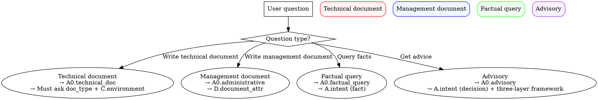

## Keywords (关键词)

- 套件总览 (suite-overview)
- 元说明 (meta-description)
- 7个skill (seven-skills)
- 调度决策树 (dispatch-decision-tree)
- 场景分流 (scenario-dispatch)
- 流程规范 (workflow-standard)
- 入口文档 (entry-document)
- 不瞎编 (no-fabrication)

# Project Doc Overview (Suite Meta Description · For Model)

## ⚠️ Hard Constraint: No Fabrication (NO FABRICATION)

All skills in this suite strictly forbid fabrication during execution:
- People names / Dates / Numbers / Tool names / Role signoff tables / Document status / Framework tags

See `../intent-clarification/references/no_fabrication.md` and the `<HARD-GATE: NO FABRICATION>` section in `../intent-clarification/SKILL.md` for details.

---

## Scenario Dispatch (Required · First Step)



> **Target reader**: **The model**. After loading this skill, the model should be able to automatically:
> - Know what each of the 7 skills in the suite does and when to invoke them
> - Know that **all "ask the user" actions must first invoke `intent-clarification`**
> - Know the `.project` directory structure and log conventions
> - Know how to orchestrate typical flows

## Purpose

This suite is used to manage **software-engineering project documents** (策划表, requirements, design, plans, test, acceptance, deployment, training, etc.).
This skill is the **model-read** entry document, not a user document.

Core principle: **Deterministic things are done by scripts; things requiring judgment/confirmation are done by the LLM**.

## Suite Roster (7 skills)

| Skill | YAML Description (Concise) | When to Invoke |
|---|---|---|
| `intent-clarification` | Unified clarification protocol: scan project materials → show existing info → ask user → log | **Any** scenario needing user confirmation (re-entrant during flow) |
| `project-doc-hub` | Dispatch entry: accept "project + document" requests → clarify → dispatch to query/outline/write/data | The first step of any "project + document" request |
| `project-doc-query` | Answer project facts/consultation: facts from 策划表/requirements/plans/contracts/emails + decision advisory | User asks "what's in the project", "when is the review" |
| `project-doc-outline` | Generate chapter outlines for 10 document types (no body) | User wants "see outline first" or during hub orchestration |
| `project-doc-write` | Fill body based on existing materials + generate decision advisory (no draft/— placeholder) | User wants "write complete document" |
| `project-doc-workflow` | 4-step pipeline checklist (query→outline→write→save-to-disk) | End-to-end automation scenarios |
| `data-skill` | Business file OCR → SQLite ingestion + self-healing verification (**Independent sub-suite**) | User wants to "ingest" data |

Full YAML descriptions see `references/skill_yaml_descriptions.md`.

## Hard Rule: Every User-Facing Question Goes Through `intent-clarification`

When the model needs to ask the user at any time:
- Project root, target document type, intent (query/generate/update)
- Fact vs decision, project-related vs industry-general
- Hardware/software/network/deployment/security level/localization/system architecture/localization list
- Document status / role signoff table
- Proactively ask when data is missing

**Must** first invoke `intent-clarification`, **forbidden** to ask inline within SKILL.md / reference.

## Process Files Location (Key: All Process Files Under .project/)

```
<用户工作根>/.project/<项目号>/          ← Sibling to project directory (e.g., <工作根>/.project/202410-C0008/)
├── project_log.md                     ← Main operation log (1 entry appended per skill flow end)
├── clarification_log.md               ← Clarification log (1 entry appended per Q/A)
├── drafts/                            ← Intermediate drafts
└── session_<YYYY-MM-DD>.md            ← Session log (optional)
```

**Do NOT** create or modify files inside any skill for runtime records.

## Dispatch Decision Tree

```
User says something related to "project + document"
  │
  ├─ Involves "ingest/OCR/SQLite" → data-skill (Independent sub-suite)
  │
  ├─ Involves "generate/update/write document"
  │   ├─ hub path
  │   │   ├─ Pure query → hub → project-doc-query
  │   │   ├─ Outline only → hub → project-doc-outline
  │   │   └─ Complete document → hub → project-doc-workflow → query→outline→write
  │   └─ Direct to a specific sub-skill (user has specified)
  │
  └─ Involves "ask the user" → Any skill first invokes intent-clarification
```

## Anti-Patterns (Strictly Forbidden for the Model)

| Anti-Pattern | Consequence |
|---|---|
| Directly invoking query/outline/write/data without calling intent-clarification | 5 inconsistent clarifications, repeated questions |
| Asking "what is the project root" inline within SKILL.md | Violates unified protocol |
| Skipping clarification and giving "should/suggest" directly | Violates HARD-GATE |
| Model inventing its own "question phrasing" to bypass intent-clarification | Protocol failure |
| Repeatedly asking the same question across skills | Should read `.project/<项目号>/clarification_log.md` |
| Writing process files under skill/references/ | Violates "process files externalized" principle |
| Skipping append to `.project/<项目号>/project_log.md` | Main log missing |

## Typical Flows

See `references/typical_flows.md` for details.

### Flow A: User Asks "What's in the Project"
1. project-doc-overview (current skill)
2. → intent-clarification (get project root + intent + scope)
3. → project-doc-query → use `explore(...)` to read project files → answer
4. → append operation record to `.project/<项目号>/project_log.md`

### Flow B: User Says "Write a Test Plan"
1. project-doc-overview
2. → intent-clarification (project root + document type + intent)
3. → project-doc-outline
4. → intent-clarification (environment/technology/compliance 10 technical points)
5. → project-doc-write
6. → intent-clarification (data integrity)
7. → Invoke "the skill that operates Word" to convert to .docx
8. → Append change record to `.project/<项目号>/06_变更及暂停/变更记录.md`
9. → append operation record to `.project/<项目号>/project_log.md`

### Flow C: Re-asking During Flow (Clarification is Re-entrant)
Any sub-skill encountering a new question at any step → invoke intent-clarification → log → continue.
